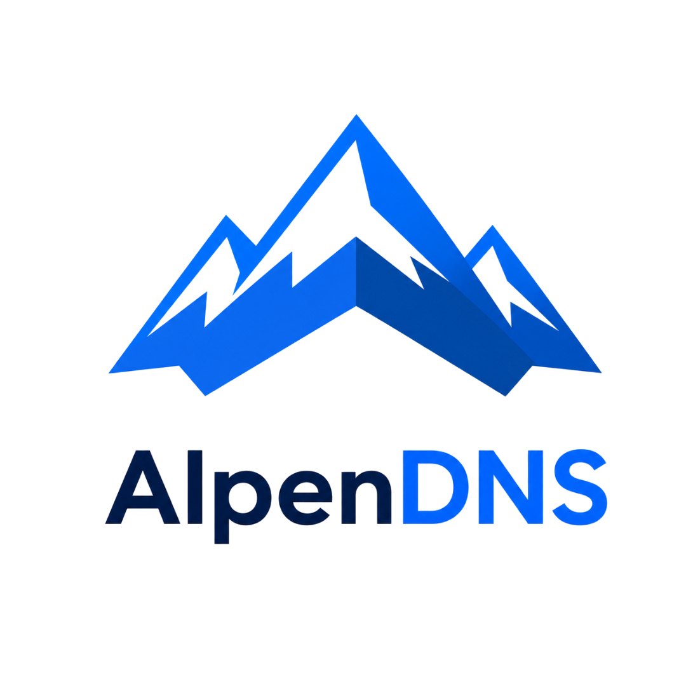
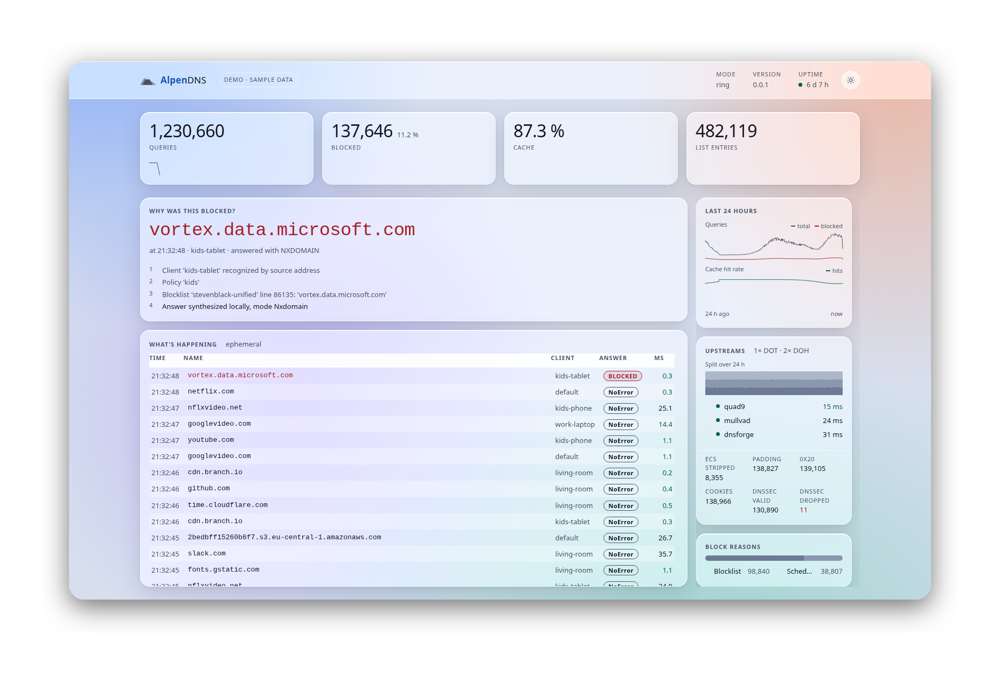

<div align="center">
  
</div>

<p align="center">
  <a href="https://florianpunz.github.io/AlpenDNS/"><b>Live demo</b></a> ·
  <a href="docs/OPERATIONS.md"><b>Install</b></a> ·
  <a href="docs/ROADMAP.md"><b>Roadmap</b></a> ·
  <a href="docs/ARCHITECTURE.md"><b>Architecture</b></a> ·
  <a href="LICENSE"><b>License</b></a>
</p>

A privacy-focused DNS server for Linux, in Rust. A **forwarding resolver**: it
accepts queries from the LAN, filters them against blocklists and policies, and
forwards them encrypted (DoT/DoH/DoQ) to upstreams. Recursion from the root
servers is deliberately not a goal.

<div align="center">
  
</div>

> **Status.** Phases 1–9 are implemented; 1–7 are accepted, and the acceptance
> run for 8 and 9 is in progress in a real home network. Where that stands, with
> numbers and open gaps: [docs/ROADMAP.md](docs/ROADMAP.md).

## About

Pi-hole and AdGuard Home solve "blocking ads on the LAN" well. AlpenDNS answers
the questions they leave open:

* **Your upstream still sees everything.** One encrypted upstream swaps a nosy
  provider for a nosy vendor. AlpenDNS spreads queries deterministically across
  several upstreams (`split_by_zone`), so no single one sees your whole profile.
* **Blocking is a black box.** "Why doesn't this site work?" is usually a search
  through the log. AlpenDNS emits a decision chain per answer: which list, which
  rule, which policy.
* **Filtering is purely list-based.** Lists know only what was known yesterday.
  AlpenDNS also evaluates locally, without the cloud: DGA, tunneling, rebinding,
  typosquatting against domains that matter to you.
* **Logging is on or off.** AlpenDNS aggregates by default behind a k-anonymity
  threshold: you see patterns, not who called what when.

Not to replace Pi-hole — to answer the questions it leaves open.

## What v1 can do

| | |
|---|---|
| Role | Forwarding resolver — no own recursion |
| Client transports | UDP/53, TCP/53 |
| Upstream transports | DoT, DoH, DoQ; cleartext only for explicit internal zones |
| Filtering | Blocklists (hosts, domains, wildcard), allowlists, regex rules |
| Policies | per client (IP/subnet), time windows, temporary grants |
| Privacy | ECS stripping, padding, DNS cookies, 0x20, upstream splitting, DNSSEC, ODoH, aggregated logging |
| Heuristics | DGA, tunneling, rebinding, typosquatting, newly registered domains — all `flag`, block nothing |
| Operations | systemd unit, .deb, Prometheus metrics, web UI, rate limiting, SIGHUP reload |

Encrypted client listeners (DoT/DoH/DoQ) and client identification via DoH path
tokens or mTLS are planned, not built — policies distinguish clients by IP today.

## What v1 is not

* **Not recursive.** It queries upstreams, not the root servers; the slot where
  recursion would hook in stays open
  ([ADR-0003](docs/adr/0003-forwarder-first.md)).
* **Not authoritative.** To host a zone, use Knot or NSD.
* **Not a DHCP server.** Pi-hole does that too; that's a different job.
* **Not a VPN.** DNS privacy protects name resolution, not the connection after
  it — [docs/THREAT-MODEL.md](docs/THREAT-MODEL.md).

## Quick start

```bash
cargo run -- -c config/alpendns.minimal.toml
dig @127.0.0.1 -p 5353 example.com

# Why was something blocked? Works without a running server:
cargo run -- -c config/alpendns.minimal.toml policy test doubleclick.net
```

The web UI is on <http://127.0.0.1:8053>; the token sits in `api.token_file`.

### As a service

```bash
cargo install cargo-deb --locked
cargo deb -p alpendns
sudo apt install ./target/debian/alpendns_<version>_amd64.deb
```

The resolver then runs unprivileged, loopback only. To serve your own network,
add the LAN address to `/etc/alpendns/alpendns.toml` and run
`sudo alpendns -c /etc/alpendns/alpendns.toml check`.

## Documentation

* [Operating](docs/OPERATIONS.md) — install, upgrade, backup, troubleshooting
* [Roadmap](docs/ROADMAP.md) — the current phase and its acceptance criteria
* [Architecture](docs/ARCHITECTURE.md) — structure, request pipeline, data model
* [Features](docs/FEATURES.md) — catalog with cost/benefit assessment
* [Testing](docs/TESTING.md) — strategy, and the definition of done
* [Benchmarks](docs/BENCHMARKS.md) · [Threat model](docs/THREAT-MODEL.md) · [Decisions](docs/adr/)
* [Configuration reference](config/alpendns.example.toml) — the target format, sections
  not yet implemented marked `[PHASE n]`

The [live demo](https://florianpunz.github.io/alpendns/) is this web UI with recorded
data, no install — built from [`web/demo/`](web/demo/).

## Development

Rust stable (`rust-toolchain.toml` pins the version).

```bash
cargo build
cargo test --all-features
```

The **definition of done** — `cargo fmt --all --check`,
`cargo clippy --all-targets --all-features -- -D warnings`,
`cargo test --all-features`, `cargo deny check` — has to be green before a change
counts as finished; [docs/TESTING.md](docs/TESTING.md) adds the manual smoke
test, the fuzzing targets and the measurement runs.

[CONTRIBUTING.md](CONTRIBUTING.md) covers setup and what this project expects of
a change. Security problems go to [SECURITY.md](SECURITY.md), not a public issue.

## License

[AGPL-3.0-or-later](LICENSE). The license is a deliberate choice: even someone
who only offers AlpenDNS as a network service must disclose the source of their
changes (AGPL §13) — that fits the project's privacy motivation.
